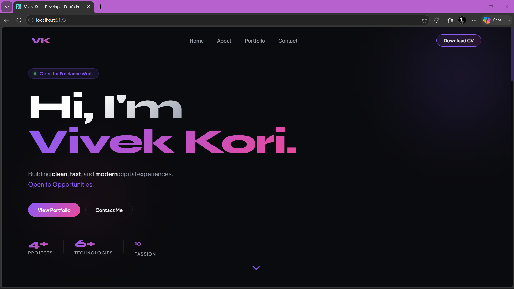
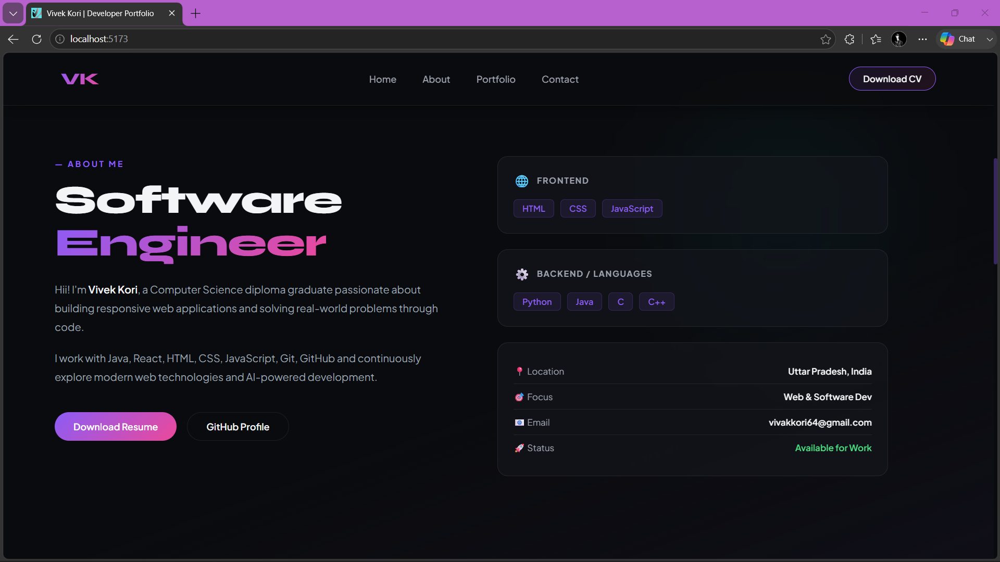
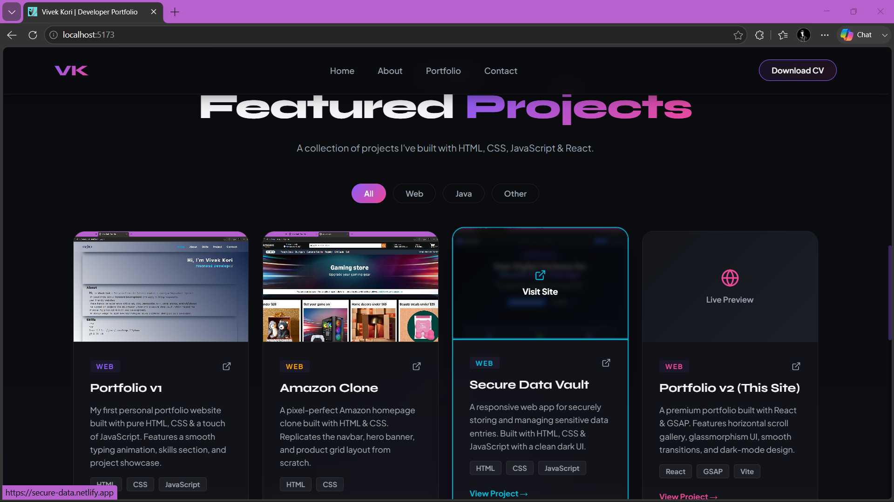
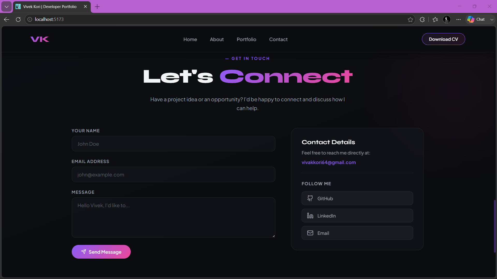

<div align="center">

# 🚀 Vivek Kori Portfolio

### Modern Developer Portfolio Website

Building clean, fast, and modern digital experiences.

[🌐 Live Demo](https://vkdevfolio.netlify.app) • [💻 GitHub](https://github.com/vivekk-coder/my_portfolio)

</div>

---

## 📖 About

A modern and responsive personal portfolio website built to showcase my projects, technical skills, and development journey.

The website features smooth UI, dark theme, responsive design, project showcase, and an interactive contact section.

---

## ✨ Features

- Modern UI/UX Design
- Fully Responsive
- Smooth Scrolling Navigation
- Dark Theme
- Project Showcase
- About Section
- Contact Form
- Download Resume
- Social Media Links
- Optimized Performance

---

## 🛠 Tech Stack

| Frontend | Styling | Tools |
|-----------|----------|-------|
| React.js | CSS3 | Git |
| JavaScript | Responsive Design | GitHub |
| HTML5 | Animations | Vite |

---

# 📷 Screenshots

## 🏠 Hero Section



---

## 👤 About Section



---

## 💼 Portfolio Section



---

## 📞 Contact Section



---

## 📂 Folder Structure

```bash
src/
│
├── assets/
├── components/
│   ├── Hero.jsx
│   ├── About.jsx
│   ├── Portfolio.jsx
│   ├── Contact.jsx
│   ├── Navbar.jsx
│   └── Footer.jsx
│
├── App.jsx
└── main.jsx
```

---

## 🚀 Installation

Clone the repository

```bash
git clone https://github.com/vivekk-coder/my_portfolio.git
```

Go to project

```bash
cd my_portfolio
```

Install dependencies

```bash
npm install
```

Start development server

```bash
npm run dev
```

Build for production

```bash
npm run build
```

---

## 🎯 Future Improvements

- Blog Section
- Project Details Page
- Light Mode
- Backend Contact Form
- Animations Enhancement
- CMS Integration

---

## 📬 Connect With Me

GitHub:
https://github.com/vivekk-coder

LinkedIn:
https://linkedin.com/in/vivek-kori

Email:
vivakkori64@gmail.com

---

<div align="center">

Made with ❤️ by Vivek Kori

⭐ Star this repository if you like it!

</div>